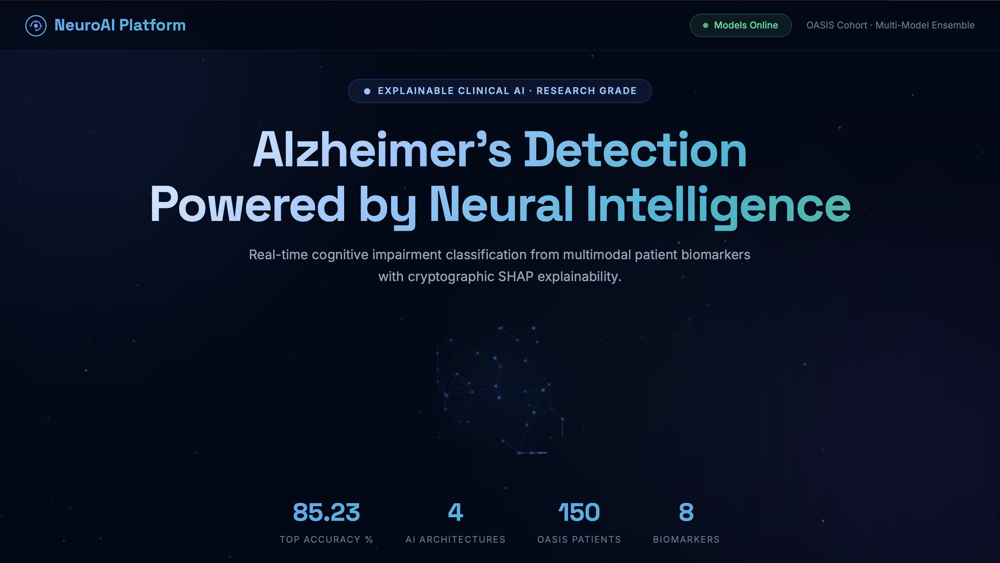
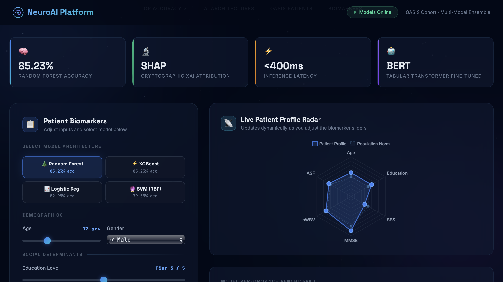
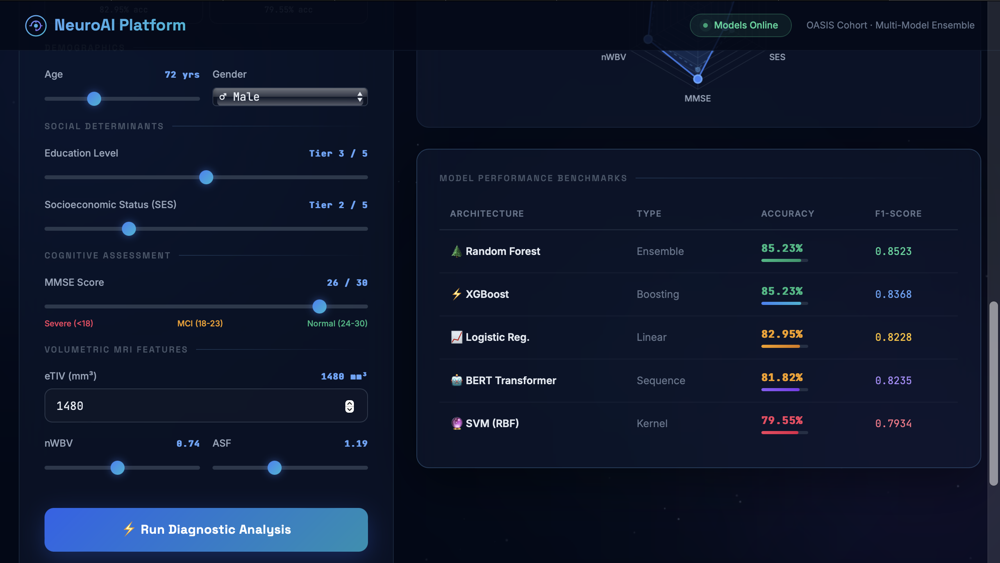
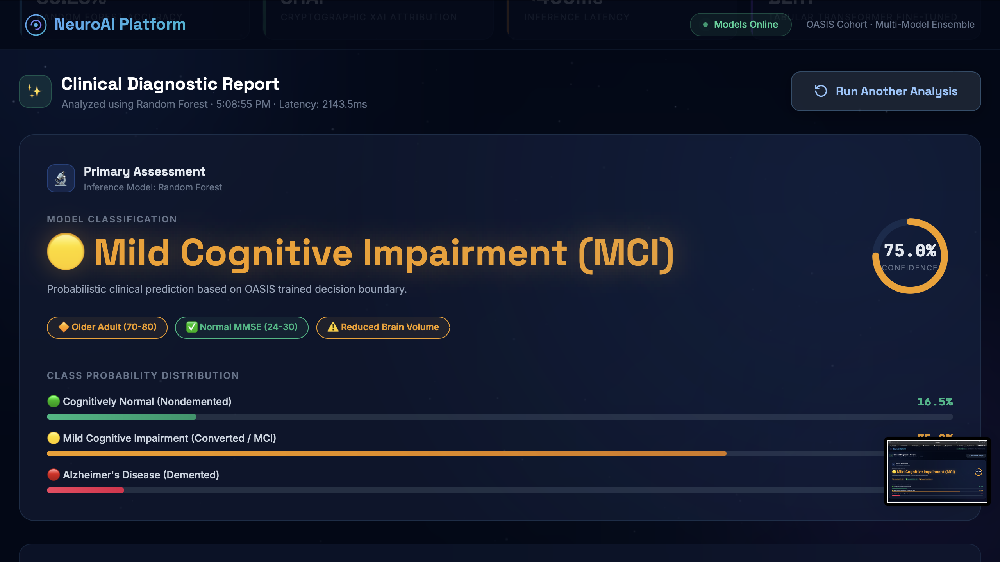
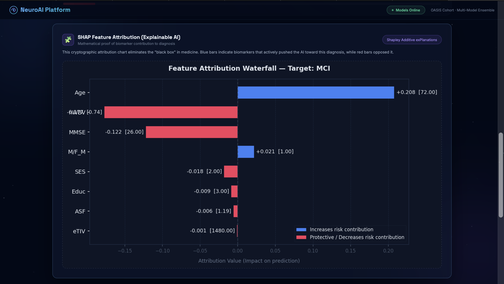
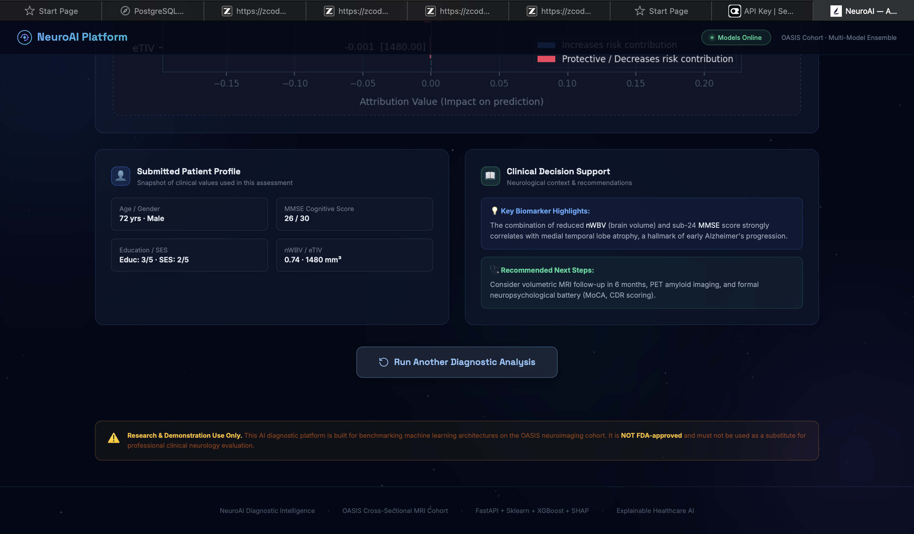
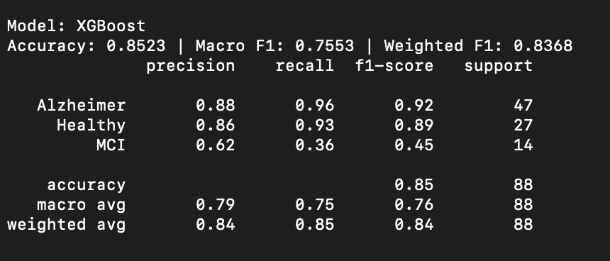
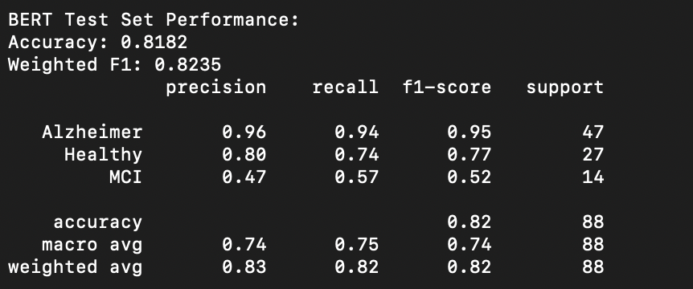

# 🧠 NeuroAI: Explainable Clinical Diagnostic Platform

An end-to-end **Artificial Intelligence** clinical diagnostic microservice built to detect cognitive impairment stages (**Cognitively Normal, Mild Cognitive Impairment, Alzheimer’s Disease**) from multimodal patient biomarkers and volumetric neuroimaging indicators.

This platform bridges classical **Ensemble Learning** algorithms with modern **Transformer-based Tabular NLP (BERT)** and cryptographic **Explainable AI (SHAP Waterfall Attribution)**, wrapped in a high-concurrency **FastAPI** backend and an interactive **two-stage clinical intelligence interface**.

<p align="left">
  
  
  
  
  
  
</p>

---

## 🖥️ Live Diagnostic Platform & User Interface

NeuroAI features a responsive, dark-mode glassmorphism interface engineered for clinical clarity and seamless decision support.

### 1. Interactive Patient Intake & Model Selection
* Real-time sliders for demographics, socioeconomic determinants, cognitive scoring, and MRI volumetrics.
* Dynamic **Biomarker Risk Profile Radar** that computes live normalized metric spreads against baseline population norms.
* Model selector supporting instant switching across multiple trained architectures.
* Calibrated **Model Benchmarks** display showing accuracy, macro/weighted F1 metrics, and latency.

<div align="center">
  
  <br/><br/>
  
  <br/><br/>
  
</div>

<br/>

### 2. Clinical Diagnostic Assessment & Explainability Stage
* Hides input controls upon inference submission to eliminate clutter and spotlight the diagnostic evaluation.
* Delivers categorical predictions (**Cognitively Normal**, **MCI**, **Alzheimer's Disease**) paired with circular confidence meters and full probability distribution bars.
* Automatically synthesizes clinical risk flags across age thresholds, cognitive decline bands (MMSE), and brain atrophy severity (nWBV).
* Embedded **SHAP Waterfall Attribution Plot** displaying the mathematical contribution of each biomarker to the prediction.
* **"Run Another Analysis"** workflow enabling doctors or researchers to pivot back into intake mode instantly.

<div align="center">
  
  <br/><br/>
  
  <br/><br/>
  
</div>

---

## ⚙️ Core Methodology & Engineering Pipeline

The system covers the complete, production-ready **Machine Learning Lifecycle**, from raw neuroimaging dataset ingestion to production REST API endpoints:

```text
                  ┌──────────────────────────────────────────────┐
                  │    OASIS Cross-Sectional MRI & Clinical Data │
                  └───────────────────────┬──────────────────────┘
                                          │
                         [Imputation, Scaling, Label Encoding]
                                          │
             ┌────────────────────────────┴─────────────────────────────┐
             ▼                                                          ▼
  [Tabular Features Pipeline]                              [Tabular-to-Text Serialization]
             │                                                          │
  ┌──────────┼───────────────┬──────────────┐                           │
  ▼          ▼               ▼              ▼                           ▼
Random    XGBoost         Logistic         SVM                      BERT-Base
Forest    Gradient        Regression       RBF                     Fine-Tuned
Ensemble  Boosting                         Kernel                  Transformer
  │          │               │              │                           │
  └──────────┴───────────────┴──────────────┴───────────────────────────┘
                                  │
                   [Cryptographic SHAP Explainability]
                                  │
                   [FastAPI Asynchronous Microservice]
                                  │
                 [Interactive Two-Stage Diagnostic UI]
```

### 1. Data Preprocessing & Biomarker Curation
* Ingested the validated **OASIS Cross-Sectional MRI dataset**.
* Handled missing clinical entries using median/mode imputation and normalized continuous brain volume metrics using `StandardScaler` to ensure optimal gradient descent convergence.
* Applied `LabelEncoder` across multi-class target phenotypes (`Nondemented`, `Converted` / `MCI`, `Demented`).

### 2. Tabular-to-Text Serialization (The "Tabular LLM" Approach)
* Engineered a custom serialization pipeline that converts structured tabular rows (Age, Education, SES, MMSE, Brain Volume) into natural language clinical vignettes.
* Allows transformer sequence classification architectures (BERT) to extract non-linear semantic relationships across patient features.

### 3. Multi-Model Architecture Benchmarking
Evaluated across distinct AI paradigms to provide a comprehensive diagnostic benchmark:
* **Tree-Based Ensembles:** Random Forest and XGBoost to capture complex non-linear interactions.
* **Linear & Kernel Baselines:** Logistic Regression and Support Vector Machines with RBF kernels.
* **Deep Transformers:** Fine-tuned `bert-base-uncased` sequence classifier utilizing Apple Silicon (MPS) / CUDA acceleration.

### 4. Explainable AI (XAI) with SHAP
* Eliminates the "black-box" dilemma in medical AI.
* Computes feature attribution scores quantifying whether an individual patient's measurements pushed the prediction toward or away from neurodegeneration.
* Renders custom dark-themed waterfall plots showing both local attribution and patient values inline.

### 5. High-Concurrency REST Microservice
* Serves model inference and explainability pipelines through a high-performance **FastAPI** backend with CORS integration and asynchronous endpoints.
* Provides `/predict`, `/models` metadata exploration, and `/health` monitoring routes.

---

## 📊 Performance Benchmarks & Terminal Logs

Evaluated on an 80/20 stratified train-test split, monitoring Accuracy, Macro F1, and Weighted F1 scores to address class distribution characteristics:

| Model Architecture | Task Type | Accuracy | Weighted F1-Score | Status |
| :--- | :--- | :--- | :--- | :--- |
| **Random Forest** | Tabular Ensemble | **85.23%** | **85.23%** | 🌲 Deployed Default |
| **XGBoost** | Gradient Boosting | **85.23%** | **83.68%** | ⚡ Real-Time Selectable |
| **Logistic Regression** | Linear ML | **82.95%** | **82.28%** | 📈 Real-Time Selectable |
| **Fine-Tuned BERT** | Transformer Classifier | **81.82%** | **82.35%** | 🤖 Sequence Classifier |
| **SVM (RBF Kernel)** | Kernel ML | **79.55%** | **79.34%** | 🔮 Real-Time Selectable |

### Confusion Matrices & Training Curves

<p align="center">
  
  
</p>
<p align="center">
  
  
</p>

---

## 🧬 Clinical Biomarkers Analyzed

The platform evaluates 8 multimodal patient markers:

| Biomarker | Clinical Description | Reference Range / Scale |
| :--- | :--- | :--- |
| **Age** | Patient chronological age | 60 – 100 years |
| **Gender** | Biological sex indicator | Male / Female |
| **Educ** | Educational attainment level | 1 (Low) to 5 (Postgraduate) |
| **SES** | Hollingshead Socioeconomic Status Index | 1 (Highest SES) to 5 (Lowest SES) |
| **MMSE** | Mini-Mental State Examination cognitive score | 0 – 30 (Normal: 24–30, MCI: 18–23, Severe: <18) |
| **eTIV** | Estimated Total Intracranial Volume | ~1100 – 1900 mm³ |
| **nWBV** | Normalized Whole Brain Volume (tissue-to-cranial ratio) | 0.60 – 0.90 (Marker of cerebral atrophy) |
| **ASF** | Atlas Scaling Factor (geometric normalization factor) | 0.80 – 1.80 |

---

## 🛠️ Repository Structure

```text
NeuroAI-Diagnostic-Platform/
├── api.py                     # FastAPI application & prediction endpoints
├── requirements.txt           # Dependencies & environment specification
│
├── data/                      # Clinical datasets
│   └── oasis_cross-sectional.csv 
│
├── models/                    # Serialized model weights & preprocessing artifacts
│   ├── Random_Forest.joblib
│   ├── XGBoost.joblib
│   ├── Logistic_Regression.joblib
│   ├── SVM_RBF.joblib
│   ├── scaler.joblib
│   ├── label_encoder.joblib
│   └── feature_names.joblib
│
├── photos/                    # Platform UI screenshots & evaluation benchmarks
│   ├── landing_hero.png
│   ├── intake_radar.png
│   ├── intake_benchmarks.png
│   ├── diagnostic_assessment.png
│   ├── shap_waterfall.png
│   ├── clinical_decision_support.png
│   ├── XGBoost.png
│   ├── Bert.png
│   ├── SVM training.png
│   └── Logistic_Regression training.png
│
├── results/                   # Confusion matrices & evaluation outputs
│   ├── cm_Random_Forest.png
│   ├── cm_XGBoost.png
│   ├── cm_Logistic_Regression.png
│   └── cm_SVM_RBF.png
│
├── src/                       # Core ML pipelines
│   ├── preprocess.py          # Imputation, feature scaling & text serialization
│   ├── train_baseline.py      # Ensemble & baseline model training
│   ├── train_bert.py          # Hugging Face Trainer script for BERT
│   └── explainability.py      # SHAP attribution & dark-mode waterfall generator
│
└── templates/                 # Frontend templates
    └── index.html             # Two-stage dashboard with Chart.js & Tailwind CSS
```

---

## 🚀 Quickstart & Local Setup

### 1. Clone the Repository
```bash
git clone https://github.com/rajatmurhe/NeuroAI-Diagnostic-Platform.git
cd NeuroAI-Diagnostic-Platform
```

### 2. Environment Setup
```bash
# Create virtual environment
python -m venv venv

# Activate virtual environment
# Windows:
venv\Scripts\activate
# Linux/macOS:
source venv/bin/activate

# Install required packages
pip install -r requirements.txt
```

### 3. Launch the Diagnostic Microservice
```bash
python api.py
```

Open your browser and navigate to:
```
http://localhost:8000
```

Interactive API documentation (Swagger UI) is accessible at:
```
http://localhost:8000/docs
```

---

## 📡 API Reference

### `POST /predict`
Submits patient biomarker values and model choice for real-time inference.

**Request Payload:**
```json
{
  "Age": 74.0,
  "Gender_Male": 1,
  "Educ": 3.0,
  "SES": 2.0,
  "MMSE": 22.0,
  "eTIV": 1450.0,
  "nWBV": 0.71,
  "ASF": 1.21,
  "model": "Random_Forest"
}
```

**Response Format:**
```json
{
  "diagnosis": "MCI",
  "probabilities": {
    "Healthy": 4.25,
    "MCI": 88.50,
    "Alzheimer": 7.25
  },
  "shap_image": "<base64_encoded_png_plot>",
  "model_used": "Random_Forest",
  "model_meta": {
    "accuracy": 85.23,
    "f1": 0.8523,
    "type": "Ensemble"
  },
  "latency_ms": 142.6
}
```

---

## 🛡️ Clinical Disclaimer
*This platform is developed exclusively for academic research, algorithmic benchmarking, and portfolio demonstration. It has not undergone clinical trial validation or FDA regulatory approval. It is not intended to serve as a substitute for professional clinical medical advice, formal neuropsychological assessment, or neurological diagnosis.*

---

## 👤 Author
* **Rajat Murhe** — [GitHub](https://github.com/rajatmurhe)
